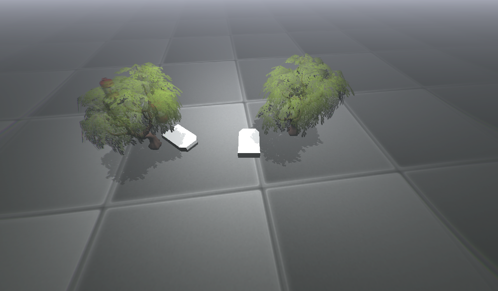
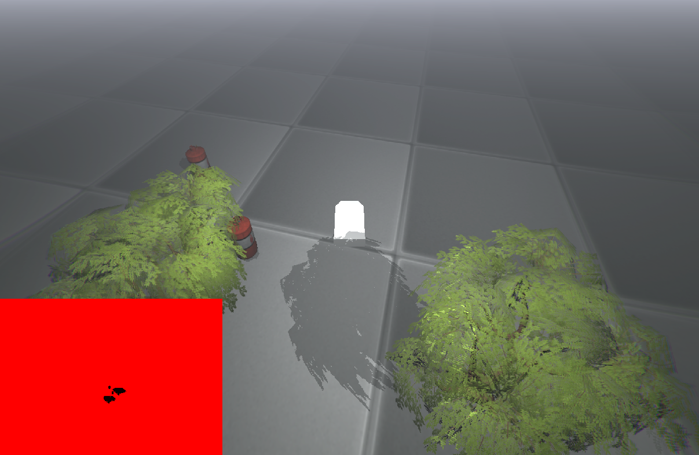

# 3DMultiplayerGame
Prototype of OpenGL 3D multiplayer game.
Project consists of:
- prototype of 3D game
- Linux game server

Game features:
- ability to load custom made level files
- advanced shader support (shadows, lighting etc.)
- multiple framebuffer rendering pipeline
- multiple threads support
- ability to play with other people via Internet

